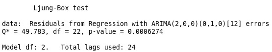

```{r, echo=FALSE, warning=FALSE, message=FALSE}
library(readr)
library(tidyverse)
library(lubridate)
library(tsoutliers)
library(forecast)
library(fpp2)
library(lubridate)
library(zoo)
accent <- "#018001"
data <- read_csv("data/2410005001-eng.csv", 
    skip = 9, n_max = 2)
data <- data[2, ]
```


# Nuestra serie de tiempo

Nuestra serie consiste en el numero de extranjeros que visitaron a Canadá por mes. En este numero se encuentran personas que viajan por negocios, estudios o turismo.

. . .

Esta serie es importante ya que esta cifra representa mucho para la economía de un país. Poder saber el numero de visitantes es importante y mucho mas después de que el COVID cambiara tanto los hábitos de muchas personas.

# Datos usados

## Obtención de datos

Los datos fueron obtenidos del sitio web **Statistics Canada** que es la oficina nacional de estadística de este país.

. . .

Statistics Canada. [Table 24-10-0050-01 Non-resident visitors entering Canada, by country of residence](https://www150.statcan.gc.ca/t1/tbl1/en/tv.action?pid=2410005001)

**DOI:** [https://doi.org/10.25318/2410005001-eng](https://doi.org/10.25318/2410005001-eng)

---

## Lectura

Al descargar los datos encontramos la siguiente estructura


## Limpieza

```{r}
# data tiene 1 fila y 601 columnas
data
```

---

```{r, echo=TRUE}
# Pasar a formato largo
data <- data |> gather(key = "date", value = "visitors")

# Quitar el primer dato
data <- data[-1, ]

# Quitar las comas de los números
data$visitors <- sapply(data$visitors, 
                          gsub, 
                          pattern = ",", 
                          replacement= "")

# Convertir la columna a numérica
data$visitors <- as.integer(data$visitors)

# Convertir de tipo string "mes año" a tipo fecha
data$date <- my(data$date)
```

---

```{r}
head(data)
```

---

Usaremos los datos desde 1990 y pasar de escala a millones.

```{r}
data <- data |> filter(date >= as.Date("1990/01/01"))

data$visitors<-data$visitors/1000000

head(data)
```

## Analisis descriptivo

```{r echo=FALSE, fig.width=6, fig.height=4}
data |> ggplot(aes(x = date, y = visitors)) + geom_line(color = accent) + labs(x = "", y = "Visitantes (en M personas)", title = "Visitantes que ingresan a Canada cada mes") + theme_bw()
```

---

```{r echo=FALSE, fig.width=6, fig.height=4}
data |> filter(date >= as.Date("2014/01/01")) |> ggplot(aes(x = date, y = visitors)) + geom_line(color = accent)+ geom_point(size = 1.75, color = accent) + labs(x = "", y = "Visitantes (en M personas)", title = "Visitantes que ingresan a Canada cada mes") + theme_bw()
```

---

```{r  echo=FALSE, fig.width=6, fig.height=4}
data$year <- year(data$date) |> as.factor()
data$month <- month(data$date) |> as.factor()

data |> filter(date >= as.Date("2014/01/01")) |>
  ggplot(aes(x = month, y = visitors, group = year)) +
  geom_line(aes(color = year), size = 0.9) +
  labs(x = "", y = "Visitantes (en M personas)",
       title = "Visitantes que ingresan a Canada por año desde 2014 hasta 2022") +  theme_bw()+
  scale_colour_manual(
    values = c(rep("#018001", 6), "#b90000", "orange", "#001bff"),
    aesthetics = "colour",
    breaks = waiver(),
    na.value = "grey50"
  )
```


# Modelo a utilizar y alternativas.

Como se pudo ver nuestra serie no se podria modelar con un SARIMA por su forma y la caida abrupta del turismo que ocurrió en 2020. Por lo que intentamos identificar todos los outliers.

. . . 

Con la función tso obtuvimos los outliers de nuestra serie, pero pensamos que los puntos atípicos estaban mal ubicados por lo que se decidió ubicar unos nuevos y comparar.


# Resultados del ajuste, diagnóstico y medidas remediales para obtener un mejor ajuste.

```{r  message=FALSE, warning=FALSE, include=FALSE}
data.ts <- ts(data$visitors,
              start = c(1990, 1),
              frequency = 12)
```

```{r}
ts.no.val <- ts(
    data$visitors[1:(nrow(data) - 5)],
    start = c(1990, 1),
    frequency = 12
  )
```

## Datos atípicos


```{r,  echo=FALSE, fig.height=4, fig.width=4}
# Usando coeficientes de forma manual
len.total <- 1:(392 + 12)
tc.ago.2021 <- cbind(I1 = stats::filter(
  as.integer(seq_along(len.total) == 380),
  filter = 0.5,
  method = "rec",
  sides = 1
))

cov.df <- data.frame(
  ls.sep.2001 = as.integer(seq_along(len.total) >= 141),
  ls.mar.2020 = as.integer(seq_along(len.total) >= 363),
  ls.abr.2020 = as.integer(seq_along(len.total) >= 364),
  ao.may.2020 = as.integer(seq_along(len.total) == 365),
  ao.jun.2020 = as.integer(seq_along(len.total) == 366),
  ao.jul.2020 = as.integer(seq_along(len.total) == 367),
  ao.ago.2020 = as.integer(seq_along(len.total) == 368),
  ao.sep.2020 = as.integer(seq_along(len.total) == 369),
  ao.oct.2020 = as.integer(seq_along(len.total) == 370),
  ao.nov.2020 = as.integer(seq_along(len.total) == 371),
  ao.dic.2020 = as.integer(seq_along(len.total) == 372),
  ao.ene.2021 = as.integer(seq_along(len.total) == 373),
  ao.feb.2021 = as.integer(seq_along(len.total) == 374),
  ao.mar.2021 = as.integer(seq_along(len.total) == 375),
  ao.abr.2021 = as.integer(seq_along(len.total) == 376),
  ao.may.2021 = as.integer(seq_along(len.total) == 377),
  ao.jun.2021 = as.integer(seq_along(len.total) == 378),
  ao.jul.2021 = as.integer(seq_along(len.total) == 379),
  tc.ago.2021 = tc.ago.2021
  )
```


---

```{r}
# Usando las covariables establecidas por nosotros
model.arima <-
  auto.arima(ts.no.val, seasonal = TRUE, 
             xreg = as.matrix(cov.df[1:387,]))
```

---

```{r warning=FALSE}
# Usando la libreria tso para encontrar los outliers
model.tso <- tso(
  ts.no.val,
  delta = 0.5, # Se usa el delta que minimiza 
               # el AIC encontrado usando un grid
  types = c("AO", "LS", "TC")
);

xreg.tso <- outliers.effects(model.tso$outliers, 392 + 12)
xreg.tso
```

---

```{r}
plot(model.tso)
```

---

```{r tres_graficas, echo=FALSE, fig.width=6, fig.height=4}
pred.manual <- forecast(model.arima, xreg =
                          as.matrix(cov.df[388:404, ]))
pred.tso <-
  forecast(model.tso$fit,
           xreg = outliers.effects(model.tso$outliers, 392 +  12)[388:404, ])

data.frame(
  real = data[1:(392-5), ]$visitors,
  pred.tso = pred.tso$fitted,
  pred.manual = pred.manual$fitted,
  date = data[1:(392-5), ]$date
) |> ggplot(aes(x = date)) + 
  geom_line(aes(y = real)) +
  geom_line(aes(y = pred.tso), color = "red", linetype = "dashed")+
  geom_line(aes(y = pred.manual), color = "darkgreen", linetype = "dashed") +
  ylab("Visitantes (en M personas)")+
  xlab("Fecha")+
  theme_bw()
```


# Supuestos de los modelos. 

## Modelo Arima


<!-- ```{r, echo=FALSE, fig.height=6, fig.width=6} -->
<!-- model.arima -->
<!-- ``` -->


---

```{r, echo=FALSE, include = FALSE}
model.arima %>% checkresiduals()
```


---


---


```{r, echo=FALSE, fig.width=6, fig.height=6, fig.align='center'}
model.arima$residuals %>% qqnorm()
model.arima$residuals %>% qqline()
```


---

```{r, echo=FALSE}
library(tseries)
jarque.bera.test(model.arima$residuals)
```

```{r, echo=FALSE}
shapiro.test(model.arima$residuals)
```


--- 

## Modelo tso

<!-- # ```{r, echo=FALSE} -->
<!-- # model.tso -->
<!-- # ``` -->


---


---

```{r, echo=FALSE, warning=FALSE}
model.tso$fit$residuals %>% checkresiduals()
```

---


<!-- ```{r, echo=FALSE} -->
<!-- Box.test(model.tso$fit$residuals, type = "Ljung") -->
<!-- ``` -->




---

```{r, echo=FALSE}
model.tso$fit$residuals %>% qqnorm()
model.tso$fit$residuals %>% qqline()
```


--- 

```{r, echo=FALSE}
library(tseries)
jarque.bera.test(model.tso$fit$residuals)
```

```{r, echo=FALSE}
shapiro.test(model.tso$fit$residuals)
```


# Realización y validación de las predicciones.

```{r, echo=FALSE}
pred.manual <- forecast(model.arima, xreg =
                          as.matrix(cov.df[388:392, ]))
pred.tso <-
  forecast(model.tso$fit,
           xreg = outliers.effects(model.tso$outliers, 392 +  12)[388:392, ])
```


```{r}
# MSE para los ultimos 5 datos no 
# considerados en el entrenamiento 
paste("MSE manual: ", mean((data[388:392, ]$visitors - pred.manual$mean[1:5])^2))
paste("MSE tso: ", mean((data[388:392, ]$visitors - pred.tso$mean[1:5])^2))
```

---

```{r}
model.arima$coef |> length()
model.tso$fit$coef |> length() 
```

---

```{r}
model.arima$bic
model.tso$fit$bic
```

---

```{r, echo=FALSE, fig.width=6, fig.height=4}
pred.manual <- forecast(model.arima, xreg =
                          as.matrix(cov.df[388:404,]))
pred.tso <-
  forecast(model.tso$fit,
           xreg = outliers.effects(model.tso$outliers, 392 +  12)[388:404,])

preds.df <- data.frame(
  date = seq(dmy("01-10-2022"),
             dmy("01-09-2023"),
             by = "month"),
  pred.manual = pred.manual$mean[6:17],
  pred.manual.l = pred.manual$lower[6:17],
  pred.manual.u = pred.manual$upper[6:17],
  pred.tso.l = pred.tso$lower[6:17],
  pred.tso.u = pred.tso$upper[6:17],
  pred.tso = pred.tso$mean[6:17]
)

data.frame(real = data$visitors,
           date = data$date)[300:392, ] |> ggplot() + #
  geom_line(aes(x = date, y = real), color = accent) +
  geom_line(data = preds.df, aes(x = date, y = pred.manual), color = "blue") +
  geom_ribbon(
    data = preds.df,
    aes(
      x = date,
      ymax = pred.manual.u,
      ymin = pred.manual.l
    ),
    alpha = 0.3,
    fill = "blue"
  ) +
  geom_line(data = preds.df, aes(x = date, y = pred.tso), color = "red")+
  geom_ribbon(
    data = preds.df,
    aes(
      x = date,
      ymax = pred.tso.u,
      ymin = pred.tso.l
    ),
    alpha = 0.3,
    fill = "red"
  )+ theme_bw()
```


# Conclusiones y recomendaciones.

En busca de un modelo que nos pueda ayudar a hacer predicciones sobre los visitantes que entran a Canadá se obtienen dos modelos, los cuales se encuentran teniendo en cuenta los datos atípicos e intervenciones. 

. . . 

Se obtiene dos modelos, uno con la función **tso**, la cual intenta encontrar los puntos atípicos automáticamente y el otro en el que asignamos manualmente los puntos atípicos y los usamos como covariables en el modelo.

. . . 

Se observa que a pesar de que ambos modelos no cumplen de los supuestos necesarios el modelo en el que asignamos manualmente los puntos atípicos tiene mejor MSE de prueba, AIC y BIC.

# Citaciones

- Statistics Canada. [Table 24-10-0050-01 Non-resident visitors entering Canada, by country of residence](https://www150.statcan.gc.ca/t1/tbl1/en/tv.action?pid=2410005001). **DOI:** [https://doi.org/10.25318/2410005001-eng](https://doi.org/10.25318/2410005001-eng)